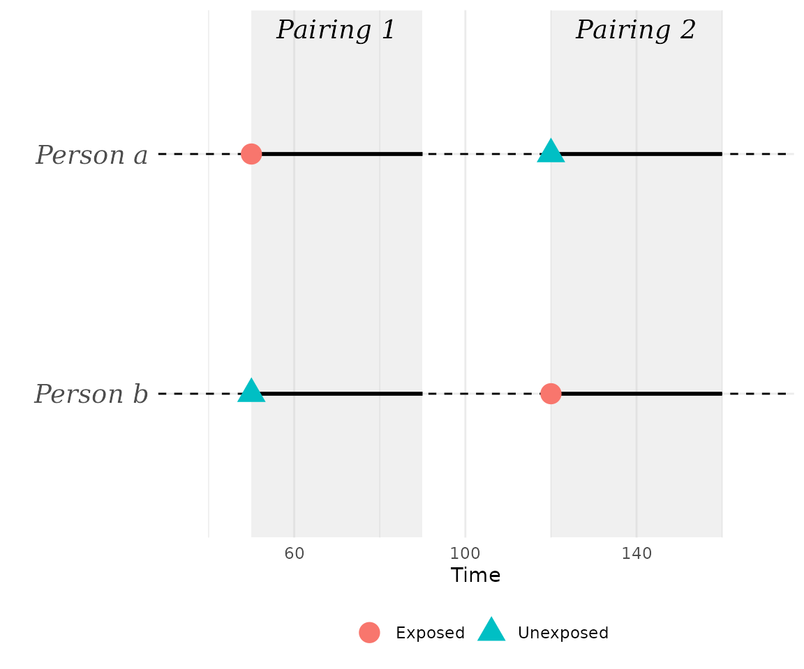
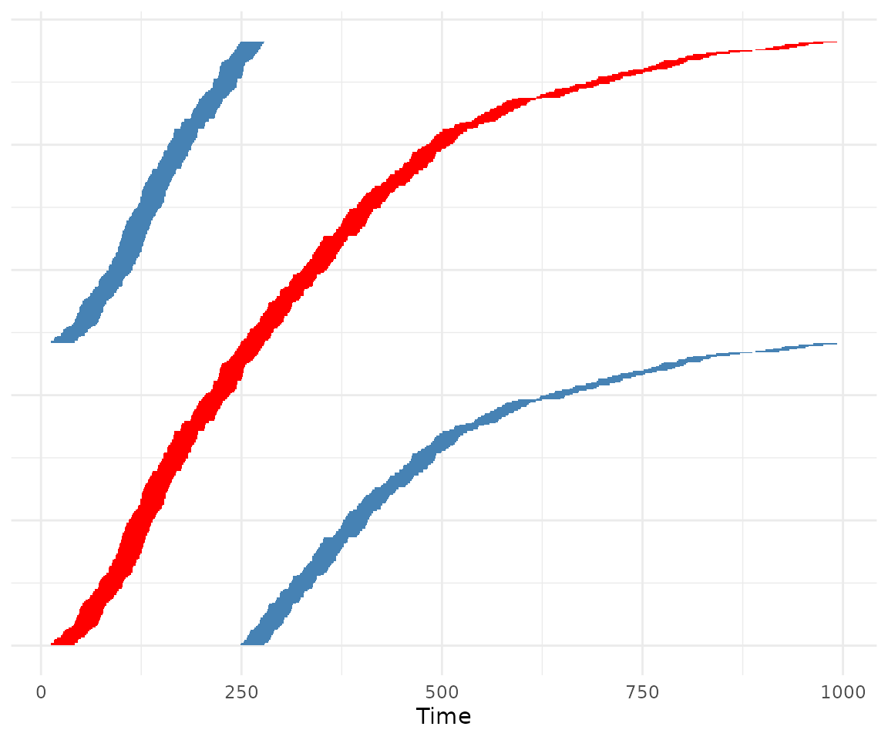
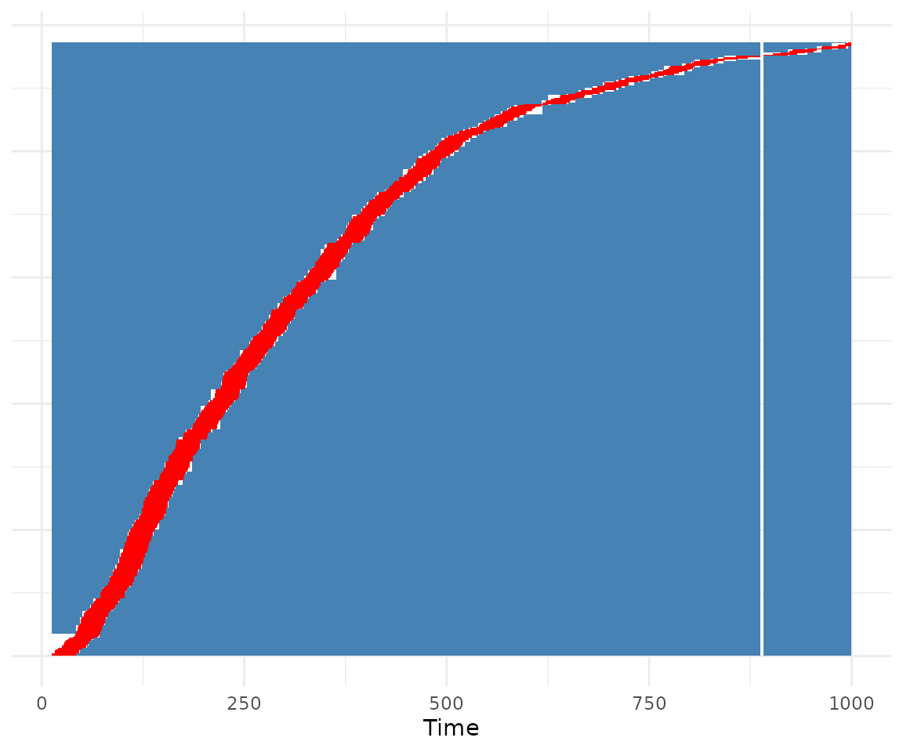
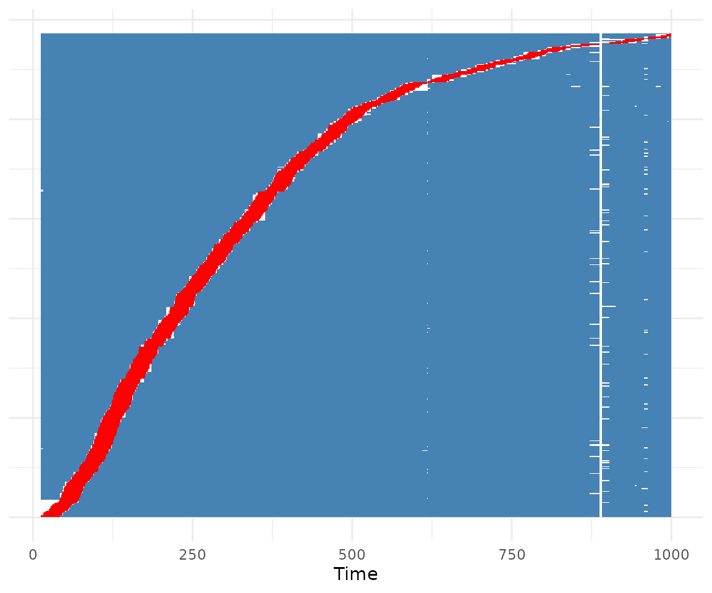

# The Symmetric Pair Matching Design in R

## Introduction

In this small vignette, we introduce the `SPMD` package, which can be
used to apply the ***S**ymmetric **P**air **M**atching **D**esign*,
introduced by Denz et al. (2026). In a nutshell, it is a type of
self-controlled method that automatically adjusts for all types of
time-invariant confounders, while also automatically controlling for any
confounding effects that arise through time itself. It is similar to the
self-controlled case series (SCCS) design (Farrington 1995), but,
contrary to the SCCS design, it does not require the user to model time
trends. The `SPMD` package is a full implementation of the method,
including multiple ways to create the required matches, confidence
interval estimation and convenient plotting methods.

The package is currently not available on CRAN, but may be installed
using the `remotes` package:

``` r

remotes::install_github("RobinDenz1/SPMD")
```

We load some packages here, although not all of them are required for
usage of `SPMD`. Some are only needed for the specific contents of this
vignette.

``` r

library(SPMD)
library(data.table)
library(ggplot2)
library(lme4)
```

## What is the Symmetric Pair Matching Design?

In the following we give a very informal and short introduction to the
SPM design. We highly encourage readers and users of the method to read
the associated paper instead (Denz et al. 2026), which describes the
method and its associated assumptions in much more detail. The goal of
the SPM design is to estimate the causal relative risk of a binary
time-dependent exposure on a possibly re-current binary time-to-event
outcome. A classic example would be the effect of a Covid-19 vaccination
on the occurrence of acute myocarditis in a short period (for example 24
days) after vaccination. Importantly, the exposure is assumed to be
transient, e.g. it is assumed that it only has an effect on the outcome
for a known duration after exposure, after which the risk goes back to
the persons baseline level.

Under the assumption that there are no time-dependent confounders of the
relationship between vaccination and the development of acute
myocarditis, two potential sources of confounding remain: (1)
time-invariant confounders, such as sex or genetics and (2) time itself.
The latter my arise when the probability for vaccination is
time-dependent and the probability for the outcome is also
time-dependent, irrespective of individual characteristics. In
vaccine-safety studies, this is frequently the case, especially for
seasonal vaccinations such as influenza vaccines. Briefly, the method
adjusts for both types of confounding through a special pair matching
structure, as its name suggests.

Individuals with exposures are matched to each other, so that they can
be used as control during the exposure period of the matched individual.
For example, suppose there are two individuals, one vaccinated on day 50
and one vaccinated on day 120. We assume a risk period of 40 days. The
resulting pairing of these two individuals would look like this:



At $`t = 50`$, person $`b`$ is exposed and his risk period of length 40
begins. Since person $`a`$ is unexposed at this time, we can use the
same duration as a control for person $`b`$. We then do the exact same
thing at $`t = 120`$, when person $`a`$ is exposed. In a table, we would
write down this pair as:

|            |      |          |       |
|------------|------|----------|-------|
| individual | time | exposure | index |
| a          | 50   | 0        | a1    |
| b          | 50   | 1        | b1    |
| b          | 120  | 0        | b2    |
| a          | 120  | 1        | a2    |

It can be shown mathematically that under fairly weak assumptions of
multiplicative effects, the following equation holds for each individual
pairing:

``` math
\theta = \frac{1}{2}\log\left(\frac{\lambda_{b1} \lambda_{a2}}{\lambda_{a1} \lambda_{b2}}\right).
```

where $`\lambda`$ are the rate parameters of Poisson distributions that
describe the number of events in the 40 day risk period in each “group”.
Of course, we cannot directly calculate this value, because those rates
are unknown. We do, however, observe the event counts in those times,
which is enough to define estimators. Those are described further down
in this vignette, after we have introduced the required data and pair
matching algorithms.

## Required Data

In principal, we only need information on two variables to apply the
symmetric pair matching design: the exposure status and the outcome.
Additionally, we need to know exactly *when* the exposures and outcome
events occurred and for whom. The most flexible and standard way to
encode this information usually used in time-to-event analysis is the
*start-stop* or *counting process* format. This corresponds to the data
format used to fit `coxph()` models (see the famous `survival` package)
and is required by the `SPMD` package as well.

To give an example, we will use the
[`sim_example_data()`](https://robindenz1.github.io/SPMD/reference/sim_example_data.md)
function of this package:

``` r

set.seed(1234)

data <- sim_example_data(n=500)
head(data)
#> Key: <.id, start>
#>      .id start  stop          X      A      Y
#>    <int> <num> <num>      <num> <lgcl> <lgcl>
#> 1:     1     0   249 -1.2070657  FALSE  FALSE
#> 2:     1   249   289 -1.2070657   TRUE  FALSE
#> 3:     1   289  1000 -1.2070657  FALSE  FALSE
#> 4:     2     0   221  0.2774292  FALSE  FALSE
#> 5:     2   221   261  0.2774292   TRUE  FALSE
#> 6:     2   261   623  0.2774292  FALSE   TRUE
```

This function internally uses the `simDAG` package to simulate this data
(Denz & Timmesfeld 2026). Here, each person is identified by a unique
person identifier contained in the `.id` column. A person may have
multiple rows, where each row corresponds to a period of time (defined
by the `start` and `stop` columns) in which no variables changed for
that individual. For example, the first row of this dataset shows that
from 0 to 249, individual with `.id = 1` was unexposed (exposure is
denoted by column `A`) and had no event (the outcome is shown in column
`Y`). Exactly at $`t = 249`$, the same person is then exposed for the
first time and stays exposed until $`t = 289`$. In other words, the
exposure, and potentially other covariates, are coded so that the
intervals are `left-closed` or `right-open`, often denoted using `[)`.

The outcome events should be coded slightly differently. Events are
assumed to happen exactly at the time denoted by `stop`. For example,
individual `.id = 2` experienced an event at exactly $`t = 623`$ in this
example dataset. This data format has two main advantages. First, it
allows usage of continuous time. Secondly, it is much more memory
efficient than the full long-format, because we usually have to store
way less rows directly. To create such datasets, the `tmerge()` function
of the `survival` package, or the `merge_start_stop()` function from the
`MatchTime` package (see <https://robindenz1.github.io/MatchTime/>) may
be used.

## General Syntax

Once such a dataset exists, it is very easy to apply the symmetric pair
matching design. We simply need to call the
[`sym_pair_matching()`](https://robindenz1.github.io/SPMD/reference/sym_pair_matching.md)
function on it, which can be done like this:

``` r

out <- sym_pair_matching(Surv(start, stop, Y) ~ A, data=data, id=".id",
                         pairs="all", estimator="moments", risk_period=30)
```

The function uses the classic time-to-event formula interface, in which
the `Surv()` function is used to define the beginning (`start`) and end
(`stop`) of the time intervals, as well as the outcome (`Y`) in this
order. The right-hand side of the formula should only contain the
exposure (`A`). In real applications, users are of course free to use
any other names. Additionally, we have to specify the unique person
identifier (`id`), the `data` in which we find all of these columns, the
duration of the risk period after exposure (`risk_period`), as well as
the method to generate the matched pairs (`pairs`) and which estimator
to use (`estimator`). Most of these arguments are discussed in greater
detail below.

Once we have created an `SPMD` object using this function, we can show
the results using the associated
[`summary()`](https://rdrr.io/r/base/summary.html) method:

``` r

summary(out)
#> ──────────────────────────────────────────────────────────────
#> Symmetric Pair Matching Design
#> ──────────────────────────────────────────────────────────────
#> Design
#>   Risk period                      30
#>   Pairing strategy                 All possible pairs
#>   Estimator                        Estimating equations
#> 
#> Sample
#>   Individuals                      500
#>   Exposed individuals              339
#>   Exposure episodes                339
#>   Individuals with >=1 event       339
#>   Exposed + event                  339
#>   Symmetric pairs                  51,233
#>   Observation time used            94.21%
#> 
#> Effect estimate
#>   log(RR)    RR
#>   0.851      2.343
#> 
#> Estimation
#>   Estimating equation: exp{1/2 log(225 / 41)}
#>   |A_n| / |E_n|^2: 0.0117922
#> ──────────────────────────────────────────────────────────────
```

## Creating the Matched Pairs

The
[`sym_pair_matching()`](https://robindenz1.github.io/SPMD/reference/sym_pair_matching.md)
function implements different options to create the matched pairs. In
the following, we give an overview of these options and show how to use
them.

### One unique Pairing

The first option to create pairs is to use each person / exposure period
in exactly one pairing. For example, if each person has only a single
exposure time, that person would be part of exactly one matched pair.
This can be done in
[`sym_pair_matching()`](https://robindenz1.github.io/SPMD/reference/sym_pair_matching.md)
by using `pairs="one"` like this:

``` r

out <- sym_pair_matching(Surv(start, stop, Y) ~ A, data=data, id=".id",
                         pairs="one", estimator="none", risk_period=30)
```

Here, we set `estimator="none"` to skip any actual estimation for now.
The function then only generates the matched pairs, which can be
inspected directly using:

``` r

head(out$d_matches)
#> Key: <.id_pair, .group>
#>      .id .time .max_t .id_pair     .A .group .end_time .n_events
#>    <int> <num>  <num>    <int> <lgcl>  <num>     <num>     <int>
#> 1:     3    12   1000        1  FALSE      1        42         0
#> 2:   114    12   1000        1   TRUE      2        42         0
#> 3:   114   249   1000        1  FALSE      3       279         0
#> 4:     3   249   1000        1   TRUE      4       279         0
#> 5:   319    12   1000        2  FALSE      1        42         0
#> 6:   493    12   1000        2   TRUE      2        42         0
```

We can also inspect the used times of the matches visually, using the
associated [`plot()`](https://rdrr.io/r/graphics/plot.default.html)
method:

``` r

plot(out)
```



In this plot, each individual that was included in the pair-generation
process forms one line of the plot (the y-axis). The red segments denote
time under exposure. Blue segments denote time without exposure, that
was used at some point as control in a matched pair. White segments
denote observation time that remained unused.

Internally, the dataset of all individual / exposure combinations is
first ordered by exposure time. Then, the dataset is “cut in half”. The
first person / exposure combination (e.g. row in the dataset) of the
first half is then matched to the first row of the second dataset. This
is not guaranteed to work. Under some extreme distributions of exposure
times, this may fail, making it a little less robust than other methods.
Additionally, since we only use each exposure instance in one pair, we
throw out a lot of information that we could include using the other
methods. Therefore, this method is generally discouraged.

### All Possible Pairs

The most statistically efficient variant is to simply use all pairs that
could possible be formed. This can be done using `pairs="all"` instead:

``` r

out <- sym_pair_matching(Surv(start, stop, Y) ~ A, data=data, id=".id",
                         pairs="all", estimator="none", risk_period=30)
```

If we use [`plot()`](https://rdrr.io/r/graphics/plot.default.html), we
can directly see that a lot more of the observation time per person is
used in the matched dataset:

``` r

plot(out)
```



Note that even though all possible matches were generated, the plot
still includes some white areas. These are observation times that could
not be used in any of the possible matches. Although using all possible
matches is statistically very efficient, it is very heavy
computationally. The upper limit of possible matches grows very fast and
can be calculated as

``` math
\frac{n \cdot (n-1)}{2},
```

where $`n`$ is the number of unique individual / exposure instances. Due
to this fast growth, it might not even be possible computationally to
generate all pairs with large $`n`$. Luckily, we do not actually need to
do this. It is perfectly acceptable to use a fixed large number of
randomly chosen pairs instead.

### Fast random selection

The package implements a random selection of pairs in two ways. The
first one is a fast selection algorithm, which generates all possible
pairs first and then takes a random sample of size `n_pairs` from the
resulting dataset. This can be done using `pairs="random2"`:

``` r

out <- sym_pair_matching(Surv(start, stop, Y) ~ A, data=data, id=".id",
                         pairs="random2", estimator="none", risk_period=30,
                         n_pairs=100000)
```

Here we used a 100,000 matched pairs, as specified through the `n_pairs`
argument. If we run
[`plot()`](https://rdrr.io/r/graphics/plot.default.html) on this again,
we can see that we are still using quite a lot of the observed time per
person at least once:

``` r

plot(out)
```



This may work for fairly large datasets and it is fairly fast, but
eventually it will fail as well due to the required RAM of the first
step. If it fails, we may use `pairs="random1"` instead.

### Memory efficient random selection

To circumvent the problem of having to create all possible matches
first, we may use an iterative algorithm instead. Here, we randomly
sample `batch_size / 2` rows from the individual / exposure dataset and
match them to further, also randomly sampled, `batch_size / 2` rows. We
then remove duplicates and invalid matches. All generated matches are
then added to the output. If we have created `n_pairs` matches, we stop.
If we have not, we repeat the process until we found enough matches or
until `rand_max_iter` iterations were executed. This can be done using
`pairs="random1"`:

``` r

out <- sym_pair_matching(Surv(start, stop, Y) ~ A, data=data, id=".id",
                         pairs="random1", estimator="none", risk_period=30,
                         n_pairs=100000)
```

It is often quite a bit slower than `pairs="random2"`, because of its
iterative nature and the sometimes large amount of invalid or repeated
matches created during the iterations. The main advantage is that it can
always be used, regardless of how many matches are possible.

### Which pair generation method should I use?

The amount of options naturally raises the question, which option is the
best. Whenever using `estimator="moments"` (which should be used in most
cases), we recommend trying `pairs="all"` first, because it is the
statistically most efficient option. If this fails due to the amount of
matches being too large, it is best to try `pairs="random2"` next, with
a large number of `n_pairs` such as 1,000,000. If that still fails due
to RAM issues, `pairs="random1"` is the best alternative (again with a
large value for `n_pairs`). One-to-one matching as implemented in
`pairs="one"` should generally only be used if the dataset is gigantic,
or when using `estimator="glmm"`.

## Estimators

After having created the symmetric pair matches, we still have to apply
an estimator to obtain the relative risk of interest. The package
implements two main estimators, the main empirical moments based
estimator (`estimator="moments"`) and an experimental estimator based on
a generalized linear mixed Poisson model (`estimator="glmm"`).

### Empirical moments based estimator

Given $`m`$ pairs of individuals, the estimator is defined as:

``` math
\hat{\theta}_m = \frac{1}{2} \ln\! \left(\frac{\frac{1}{m}\sum_{i = 1}^m X_{b1} X_{a2}}{\frac{1}{m}\sum_{i = 1}^m X_{a1} X_{b2}}\right),
```

where $`X_{a1}`$, $`X_{a2}`$, $`X_{b1}`$ and $`X_{b2}`$ denote the
observed event counts in each “index” inside a pair. Essentially, we
average over individual level products of events in both the denominator
and numerator. By taking [`exp()`](https://rdrr.io/r/base/Log.html) of
the resulting $`\hat{\theta}_m`$, we obtain an estimate of the causal
risk ratio. In this package, this estimator can be used by setting
`estimator="moments"`.

### Generalized linear mixed model based estimator

An alternative experimental estimator is based on a generalized linear
mixed Poisson model, where an individual and time-specific random effect
is modeled directly. This method may be more efficient than the moments
based estimator, because it utilizes information across pairs more
efficiently, but it is also fairly difficult to fit. In many cases, it
will not converge in practice. We recommend not using this estimator for
now, as its theoretical properties have not been studied in detail.

## Confidence interval estimation

The estimators by themselves only return a point estimate (e.g. an
estimate of the relative risk). In most applications, we are, however,
also interested in estimating the uncertainty of this point estimate.
This is often done using confidence intervals. We may also wish to test
the hypothesis, that the true relative risk is 1, which is often done
using p-values. Currently, no equation exists that could be used to
directly estimate the standard error of the estimate, which would be
required for both applications. We therefore usually rely on
bootstrapping, which is implemented into the
[`sym_pair_matching()`](https://robindenz1.github.io/SPMD/reference/sym_pair_matching.md)
function through the `bootstrap` argument:

``` r

out <- sym_pair_matching(Surv(start, stop, Y) ~ A, data=data, id=".id",
                         pairs="all", estimator="moments", risk_period=30,
                         bootstrap=TRUE, n_boot=1000)
summary(out)
#> ──────────────────────────────────────────────────────────────
#> Symmetric Pair Matching Design
#> ──────────────────────────────────────────────────────────────
#> Design
#>   Risk period                      30
#>   Pairing strategy                 All possible pairs
#>   Estimator                        Estimating equations
#> 
#> Sample
#>   Individuals                      500
#>   Exposed individuals              339
#>   Exposure episodes                339
#>   Individuals with >=1 event       339
#>   Exposed + event                  339
#>   Symmetric pairs                  51,233
#>   Observation time used            94.21%
#> 
#> Effect estimate
#>   log(RR)    RR         SE         95% CI          P-value
#>   0.851      2.343      0.649      1.356 – 3.855   0.006
#> 
#> Bootstrap: 1,000 replicates
#> 
#> Estimation
#>   Estimating equation: exp{1/2 log(225 / 41)}
#>   |A_n| / |E_n|^2: 0.0117922
#> ──────────────────────────────────────────────────────────────
```

Here, we first draw `n_boot` random samples with replacement from all
individuals, where the size of the samples is equal to the number of
unique individuals in the dataset. Then, we apply the pair matching to
each of these datasets. Afterwards, we apply the estimator to all
matched datasets. The result is a vector of `n_boot` bootstrap
estimates. To estimate a 95% confidence interval, we use the percentile
method, in which the lower 0.025 and upper 0.975 quantiles of this
bootstrap distribution is used directly. P-values are calculated
similarly, although with the caveat that a bootstrap p-value can never
be smaller than `1 / n_boot`.

We can inspect the distribution of the bootstrap samples directly using
something like:

``` r

plot(density(out$boot_est))
```


Ideally, the distribution should look more or less Gaussian. In any
case, it is recommended to set the number of bootstrap samples high
enough so that the distribution looks fairly smooth. `n_boot=1000` is a
good start, but may not always be sufficient.

Bootstrapping may become fairly computationally expensive, particularly
with large samples and `pairs="all"` or `pairs="random1"` /
`pairs="random2"` when using many matches. We have implemented some
computational tricks that keep the computation time low, particularly
when using `pairs="all"`. In this case, the pair matching is only done
once and the bootstrap samples are generated directly from all pairs
through re-weighting them. This is possible because repeated inclusion
of individuals never generates new samples (individuals cannot match
themselves, because the risk periods would overlap). Additionally, the
`n_cores` argument may be used to run the bootstrap calculations on
multiple processing cores, potentially saving much more time as well.

## Some subtleties

### Censoring

Right-censoring is directly supported by this package. The underlying
algorithm uses pairs in which no observation period is censored, and
pairs in which the right-censoring occurs after the larger of the two
exposure times in a pair. In the latter case, both individuals inside
the pair are censored at the minimum censoring time when calculating
$`X_{a2}`$ and $`X_{b2}`$. This way, the time effects still cancel out.
For more information and required assumptions regarding censoring,
please consult the associated paper (Denz et al. 2026).

### Bounds of the risk period

The `bounds` argument allows users to specify whether / which endpoints
of the risk periods defined by the exposure times and `risk_period`
arguments should be included or excluded. It is particularly important
to specify this argument if the measurements of exposure and outcome
times is done in discrete time. See
[`?sym_pair_matching`](https://robindenz1.github.io/SPMD/reference/sym_pair_matching.md)
for a full explanations on supported values.

### Time zero

In randomized controlled trials, time zero (e.g. the begin of the
observation period) is well defined for each participant in the study.
This is not necessarily the case for retrospective studies. For example,
when analyzing electronic health records based data, multiple choices
for time zero, such as the date of a diagnosis or the first date of
eligibility, may be appropriate. Theoretically, any time scale may be
used for the application of SPMD. It is, however, crucial that the
choice of time scale reflects the time trends the user wants to adjust
for. For example, if time trends in the outcome are caused by calender
time and are shared across individuals, the time scale should be the
calender time. If, on the other hand, the time trends are anchored to
time since a diagnosis, than time zero should be the date of diagnosis.

## References

Denz, Robin, Filippo Saatkamp, Katharina Meiszl and Nina Timmesfeld
(2026). “The Symmetric Pair Matching Design: A Self-Controlled Method
with Automatic Adjustment for Time Effects”. arXiv Preprint. doi:
10.48550/arXiv.2608.25979.

Farrington, C. Paddy (1995). “Relative Incidence Estimation from Case
Series for Vaccine Safety Evaluation”. In: Biometrics 51.1, pp. 228–235.
doi: 10.2307/2533328.

Denz, Robin and Nina Timmesfeld (2026). “Simulating Complex
Cross-Sectional and Longitudinal Data using the simDAG R Package”.
Journal of Statistical Software 116 (2), doi: 10.18637/jss.v116.i02.
